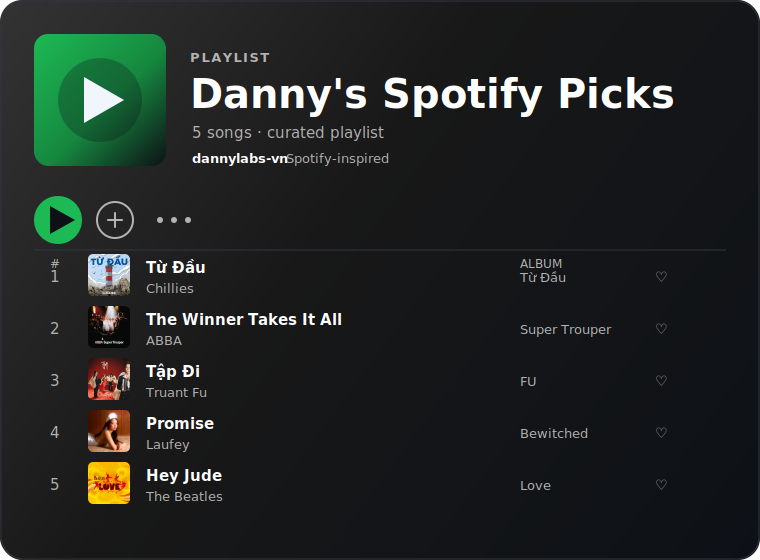

<div align="center">

<br>

# Hong Dao Kiet


<br>

Building software at the intersection of engineering,<br>
artificial intelligence, and thoughtful design.

---

</div>

<br>

<h3 align="center"><code>~/about</code></h3>

<br>

```js
const danny = {
    name: "Hong Dao Kiet",
    role: "Software Engineer & AI Researcher",
    education: "SWE @ University of Technology Sydney 30'",
    president: "Science & Technology Club Le Quy Don High School",
    founder: "EcoAI Youth Innovators",
    interests: ["Artificial Intelligence", "Computer Vision", "IoT", "Full Stack"],
    currentlyLearning: ["Next.js", "Advanced System Design", "ML Research"],
    currentlyBuilding: "PeerNoted, CapCuu, ViTeM, SmartBites",
    philosophy: "The many challenges in life appear only because the universe knows we have the strength to conquer them."
};
```

<br>

---

<br>

<h3 align="center"><code>~/stack</code></h3>

<br>

<div align="center">

**Languages**


<br>

**Frontend**


<br>

**Backend & AI**


<br>

**Tools**


</div>

<br>

---

<br>

<h3 align="center"><code>~/projects</code></h3>

<br>

<div align="center">
<table>
<tr>
<td width="50%" valign="top">

**PeerNoted**

Peer-to-peer study notes platform.

`TypeScript` · Active

[→ Repository](https://github.com/dannylabs-vn/peernoted)

</td>
<td width="50%" valign="top">

**CapCuu**

Emergency response coordination system.

`HTML` `TypeScript` · Active

[→ Repository](https://github.com/dannylabs-vn/capcuu_new)

</td>
</tr>
<tr>
<td width="50%" valign="top">

**ViTeM**

Vietnamese teaching management platform.

`JavaScript` · Active

[→ Repository](https://github.com/dannylabs-vn/ViTeM)

</td>
<td width="50%" valign="top">

**Emotions Detection**

Real-time emotion recognition with computer vision.

`Python` · Research

[→ Repository](https://github.com/dannylabs-vn/emotions_detec)

</td>
</tr>
<tr>
<td width="50%" valign="top">

**Weather Prediction**

ML-powered weather forecasting system.

`Python` · Research

[→ Repository](https://github.com/dannylabs-vn/weather_prediction)

</td>
<td width="50%" valign="top">

**Electric Warning Device**

IoT-based electrical safety monitoring.

`IoT` `Hardware` · Completed

[→ Repository](https://github.com/dannylabs-vn/electricwarningdevice)

</td>
</tr>
</table>
</div>

<br>

---

<br>

<h3 align="center"><code>~/metrics</code></h3>

<br>

<div align="center">

</div>

<br>

<div align="center">

</div>

<br>

<div align="center">

</div>

<br>

---

<br>

<h3 align="center"><code>~/now play</code></h3>

<br>

<div align="center">
  
</div>

<br>

---

<br>

<h3 align="center"><code>~/terminal</code></h3>

<br>

```
$ whoami
→ Software Engineer & AI Researcher

$ focus
→ Building meaningful software.

$ currently
→ PeerNoted · CapCuu · AI Research

$ status
→ Always learning. Always building.
```

<br>

---

<br>

<div align="center">

<br>

*Designed with simplicity. Built with curiosity.*

<br>

<br><br>

</div>
