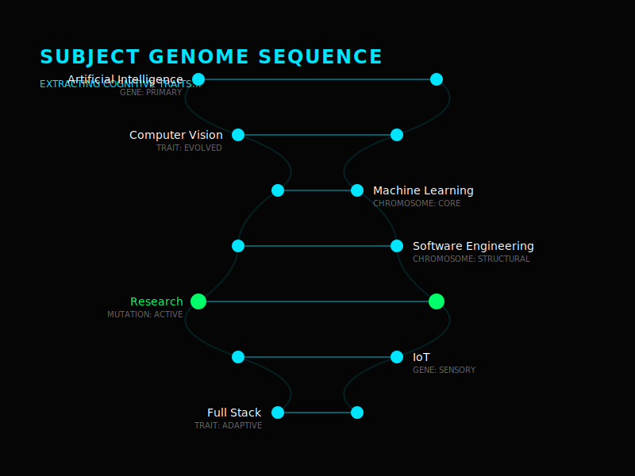
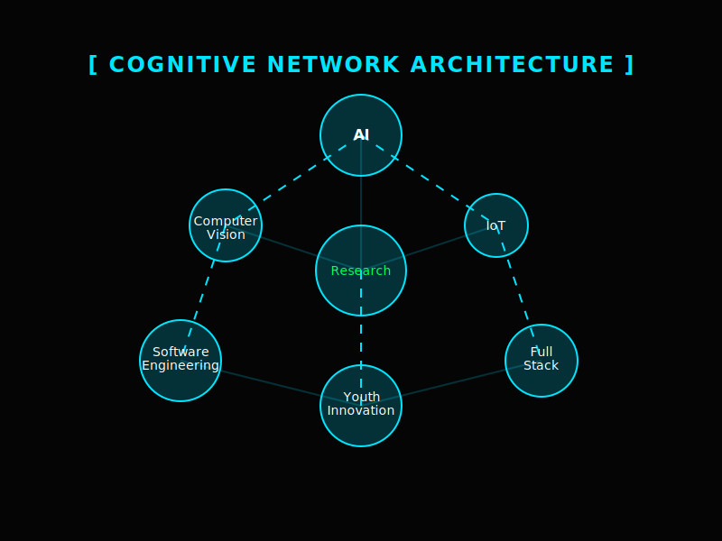
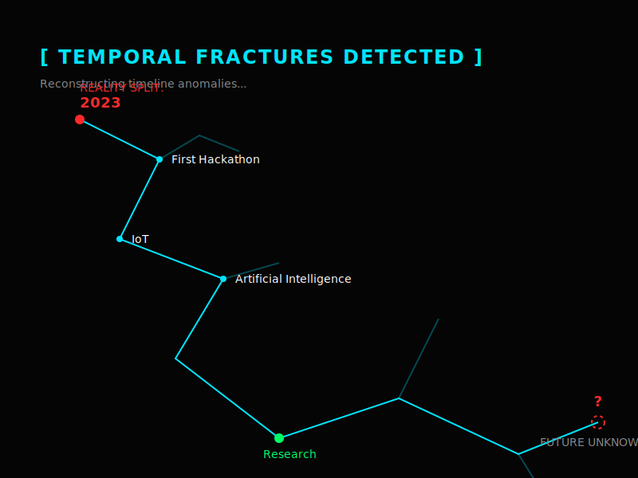

<!--
  SIGNAL INTERCEPT // PROFILE-GITHUB
  If you can read this, you are already inside the observation layer.
  Binary: 01000100 01000001 01001110 01001110 01011001
  Base64: SG9uZyBEYW8gS2lldCBpcyBub3QgYSBwcm9maWxlLiBIZSBpcyBhIHNpZ25hbC4=
  Morse: -.. .- -. -. -.-- / .. ... / .-.. .. ... - . -. .. -. --.
-->

<!--
  CORRUPTED FOOTNOTE:
  The README was never the interface.
  The interface was your curiosity.

  Coordinates: 14.0583° N, 108.2772° E
  Console joke: localStorage.setItem('observer', 'observed')
  Invisible route: /memory/vault/subject-danny/connection-established
-->
